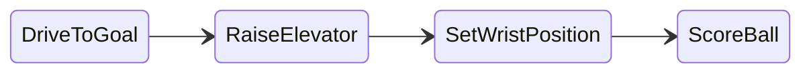
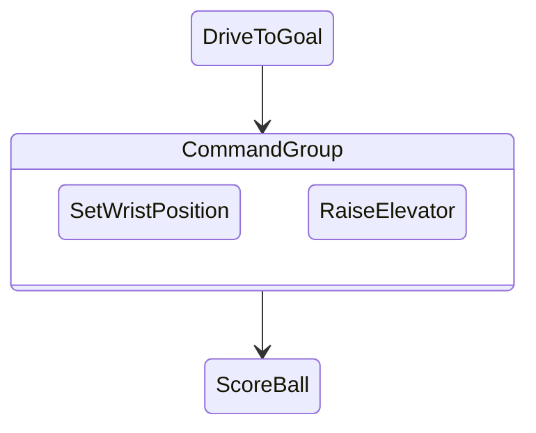
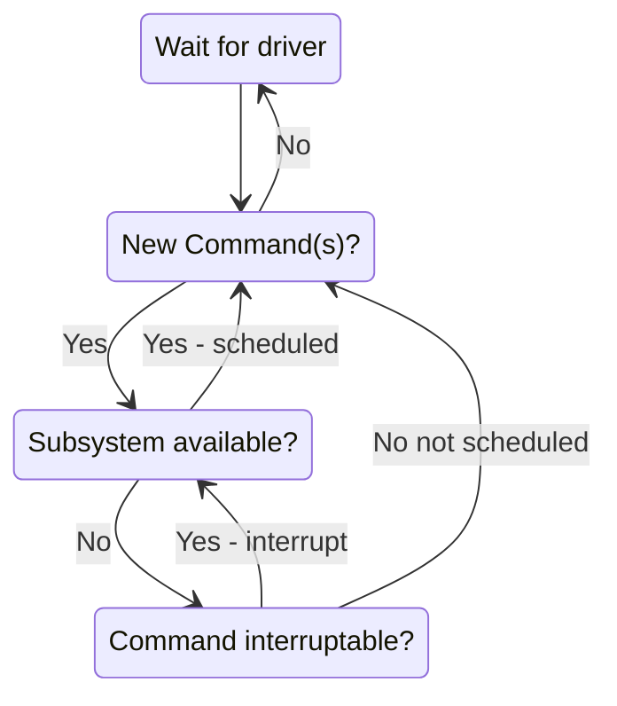

# Getting started

## Basic FRC code structure (Java)
All the robot base code is built from a set of libraries maintained by WPI (Worcester Polytechnic Institute).  The library handles the many small details of getting your robot to work with your team and allowing many teams to run robots together in a competition.

* Main.java - DON'T CHANGE ANYTHING IN IT! :)  All this file does is start up an object called Robot.
* Robot.java - responsible for the program’s control flow and should be mostly empty.  Notice how the names of the methods declared (autonomous, teleop, test) match the operations in the FRC Driver Station.  Two important points: the CommandScheduler.getInstance().run() call in the robotPeriodic() method is essential, and the teleopInit() method cancels any still-running autonomous commands.  Only advanced programmers should modify this file.
* RobotContainer.java - where you define the basic capabilities of your robot - what the RoboRio is connected to and how to use those resources.  This is where you will bind commands to triggering events (such as buttons), and specify which command you will run in your autonomous routine.
* Constants - where non-changing robot values (such as speeds, unit conversion factors, PID gains, and sensor/motor port numbers) are stored.
* Subsystems - encapsulate parts of the robot into easy to use software objects.  For instance, "Drivetrain" is usually used for moving the robot base around.  In your code, you just send the object a throttle and turning speed.
* Commands - make it easy to group together sequences of robot actions.  For instance, driving up to the scoring station on the playing field and throwing in a ball.

## Why do we need all this complexity?
* Robot actions happen over time (raise the arm, move to a new spot), so act/wait looping is always there
* Multiple actions need to occur at once (raise the arm, open the gripper, move forward)
* If something is not working correctly, it is easy to isolate one action
* Robot behavior needs to be changed quickly at competition

## How commands work

Commands let you break up the tasks of operating the robot into small chunks. Each command has an execute() method that does some work and an isFinished() method that tells if it is done. This happens on every update from the driver station or about every 20ms. Commands can be grouped together and executed sequentially, starting the next one in the group as the previous one finishes.

## Concurrency

Sometimes it is desirable to have several operations happening concurrently. In the previous example you might want to set the wrist position while the elevator is moving up. In this case, a command group can start a parallel command (or command group) running.

## How it works - Scheduling commands

There are three main ways commands are scheduled:
* Manually, by calling the start() method on the command (used for autonomous)
* Automatically by the scheduler based on button/trigger actions specified in the code (typically defined in the OI class but checked by the Scheduler).
* Automatically when a previous command completes (default commands and command groups).
Each time the driver station gets new data, the periodic method of your robot program is called. It runs a Scheduler that checks the trigger conditions to see if any commands need to be scheduled or canceled.

When a command is scheduled, the Scheduler checks to make sure that no other commands are using the same subsystems that the new command requires. If one or more of the subsystems is currently in use, and the current command is interruptible, it will be interrupted and the new command will be scheduled. If the current command is not interruptible, the new command will fail to be scheduled.

## How It Works - Running Commands
After checking for new commands, the scheduler proceeds through the list of active commands and calls the execute() and isFinished() methods on each command. Notice that the apparent concurrent execution is done without the use of threads or tasks which would add complexity to the program. Each command simply has some code to execute (execute method) to move it further along towards its goal and a method (isFinished) that determines if the command has reached the goal. The execute and isFinished methods are just called repeatedly.

## Command Groups
More complex commands can be built up from simpler commands. For example, shooting a disc may be a long sequence of commands that are executed one after another. Maybe some of these commands in the sequence can be executed concurrently. Command groups are commands, but instead of having an isFinished and execute method, they have a list of other commands to execute. This allows more complex operations to be built up out of simpler operations, a basic principle in programming. Each of the individual smaller commands can be easily tested first, then the group can be tested.


# Running start with Romi
Do not save any code to the Desktop!  It will quickly become difficult to organize and find what you need.

> Each laptop has a folder called C:\Users\\[PabloComputer].
> Create a folder named “FRC2023Summer” and save all your code there.

## Visual Studio Shortcuts
* `Ctrl+Shift+P` brings up the command palette. (or click the red hexagon with the W)
* All First Robotics commands will start with `WPILib:`
* `F5` simulates the code (or runs a Romi)
* `Ctrl+F5` loads the code into a RoboRio (the competition robot)

## Documentation
https://docs.wpilib.org

This is your best resource.  Remember it!
(Make sure you are reading the most up to date version)
We will be using Java to program the robots to keep things simple.  If you see a code example, sometimes you have to switch it to a Java view.

### Important Documentation Sections:
* [Zero to Robot](https://docs.wpilib.org/en/stable/docs/zero-to-robot/introduction.html)
* [VS Code Overview](https://docs.wpilib.org/en/stable/docs/software/vscode-overview/index.html)
* [Basic Programming](https://docs.wpilib.org/en/stable/docs/software/basic-programming/index.html)
* [Getting Started with Romi](https://docs.wpilib.org/en/stable/docs/romi-robot/index.html)
* [Command-based programming](https://docs.wpilib.org/en/stable/docs/software/commandbased/index.html)

## Quick Start
1. Boot up your Romi. (There is a very small button labeled "Power" on the corner of the board)
2. Find your Romi WiFi access point and connect to it. (you will temporarily lose Internet access)
3. Make sure you have a joystick or controller connected to your laptop.
4. Start Visual Studio Code (2022 WPILib version).
5. Type `Ctrl-Shift-P` (or push the little red hexagon with a W) and select `WPILib:Create a new project`.
    * Select Example -> Java -> RomiReference.
    * The base folder is your FRC2023Summer folder!
    * Yes, create a new folder from the project name (your choice).
    * Team Number: 8744 (important when using the big robot)
    * Do **Not** enable desktop support.
6. Once it is done configuring, type `F5` to compile the code and start a simulation to run the Romi.
7. Look for data from the accelerometer to verify that you have a connection to the Romi.
8. Add your joystick/controller as an input device. (Drag "System Joysticks" to "JoySticks")
9. In the driver station simulation, change **Robot State** to "Teleoperated".
9. **Drive!**

### Coding Exercise 1 - Customise the joystick
1. Shutdown the simulation (close the simulation window or click on the red square in VSC).
2. Open the file named RobotContainer.java and find the method `getArcadeDriveCommand()`.
3. Change the axis numbers so that throttle and steering are on the same control stick (or however you like).  Remember that you can see the joystick data in the simulation window.
4. Hit `F5` to restart the simulation and test it out.
5. You will notice one control has a negative sign on it to get the direction right.  Try multiplying an axis by 0.5 to see if you can adjust the sensitivity of the joystick.

### Coding Exercise 2 - Bind a LED to a button
1. Shutdown the simulation (close the simulation window or click on the red square in VSC).
2. Right click on the `commands` folder and select the option at the bottom for `Create a new class/command`.  Select `Command (New)` from the list. Name it `UpdateLight`.
3. Make your code look like this:
```
// Copyright (c) FIRST and other WPILib contributors.
// Open Source Software; you can modify and/or share it under the terms of
// the WPILib BSD license file in the root directory of this project.
 
package frc.robot.commands;
 
import edu.wpi.first.wpilibj2.command.CommandBase;
import frc.robot.subsystems.OnBoardIO;
 
public class UpdateLight extends CommandBase {
  private final OnBoardIO m_romi_io;
  private final boolean YellowState;
  /** Creates a new UpdateLight. */
  public UpdateLight(OnBoardIO thisRomi, boolean YellowLED) {
    // Use addRequirements() here to declare subsystem dependencies.
    m_romi_io = thisRomi;
    addRequirements(thisRomi);
 
    YellowState = YellowLED;
  }
 
  // Called when the command is initially scheduled.
  @Override
  public void initialize() {}
 
  // Called every time the scheduler runs while the command is scheduled.
  @Override
  public void execute() {
    if (YellowState == true) {
      m_romi_io.setYellowLed(true);
    } else {
      m_romi_io.setYellowLed(false);
    }
 
  }
 
  // Called once the command ends or is interrupted.
  @Override
  public void end(boolean interrupted) {}

  // Returns true when the command should end.
  @Override
  public boolean isFinished() {
    return false;
  }
}
```

4. Now go back to RobotContainer.java and find the method `configureButtonBindings()`.
5. After the section demonstrating the on-board button, add this:
```
    m_onboardIO.setYellowLed(false);  // Set default state
    Trigger ThisButton = new JoystickButton(m_controller, 1);
    ThisButton
      .onTrue(new UpdateLight(m_onboardIO, true))
      .onFalse(new UpdateLight(m_onboardIO, false));
```
6. Clear up all warnings and errors (ask about QuickFix!), then start a simulation to see if it works!

### Coding Challenge - Autonomous maze
Use the commands in the code example to create an autonomous routine for the floor maze!

[Documentation for Binding Commands to Joystick Buttons](https://docs.wpilib.org/en/stable/docs/software/commandbased/binding-commands-to-triggers.html)


## Useful Romi Documentation
[Romi Control Board Schematic](https://www.pololu.com/file/0J1258/romi-32u4-control-board-schematic-diagram.pdf)

[Romi Control Board Pinout](https://www.pololu.com/file/0J1261/romi-32u4-control-board-pinout-power.pdf)

[Romi Control Board User's Guide](https://www.pololu.com/docs/0J69)

[Inroduction to FRC software development (old, but still very useful)](https://youtu.be/64hPDvphcfA)
